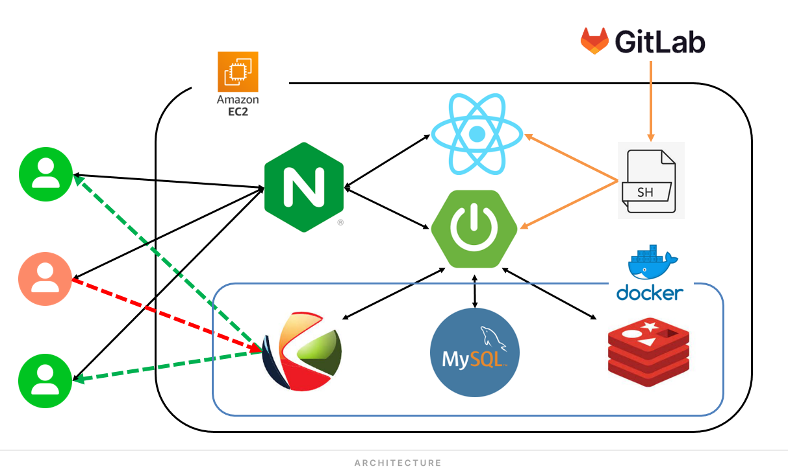

# Catch UP - 실시간 버스킹 스트리밍 서비스

> [Catch Up](https://i10a105.p.ssafy.io/)

Catch UP은 버스킹 공연의 매력을 더 많은 사람들과 공유하고, 언제 어디서든 버스킹 공연을 즐길 수 있도록 하는 실시간 버스킹 스트리밍 플랫폼입니다. 청중, 버스커, 공동체 모두가 만족하는 버스킹 문화를 만들어갑니다.

## 프로젝트 구조

Catch UP 프로젝트는 다음과 같은 브랜치 구조를 가지고 있습니다:

- **master 브랜치**: 프로젝트의 아키텍처 관련 자료와 기본적인 문서가 저장되어 있습니다. 이 브랜치는 프로젝트의 기본 구조를 정의하고, 전반적인 아키텍처 설계를 제공합니다.

- **FE_develop 브랜치**: 프로젝트의 프론트엔드 개발을 위한 브랜치입니다. 사용자 인터페이스 디자인, 클라이언트 사이드 로직, 프론트엔드 관련 기술 스택의 개발이 이 브랜치에서 진행됩니다.

- **BE_develop 브랜치**: 백엔드 개발을 위한 브랜치입니다. 서버 사이드 로직, 데이터베이스 관리, API 개발 등 백엔드 관련 작업이 이 브랜치에서 이루어집니다.

각 브랜치는 특정 개발 영역에 초점을 맞추며, 개발 과정에서 협업과 코드 리뷰를 용이하게 하기 위해 분리되어 관리됩니다.

## 프로젝트 아키텍쳐

- nginx를 통하여 도메인에 https를 적용하고 리버스 프록시를 설정합니다.
- docker-compose를 사용하여 kurento media server, MySQL, reddis를 띄워 사용합니다.
- reddis를 사용하여 spring에서의 세션정보를 캐싱합니다.
- 도커 컨테이너의 MySQL은 데이터 관리를 위해 볼륨을 설정하여 영구적으로 보관합니다.
- 쉘스크립트를 통하여 서비스 배포를 자동화합니다.

## 주요 기능

- **스트리밍**: 사용자는 앱을 통해 주변의 실시간 버스킹 공연을 찾아볼 수 있습니다.
- **지도**: 공연 장소에 대한 정보를 제공하고, 길찾기 기능을 통해 쉽게 해당 장소까지 이동할 수 있습니다.
- **버스커 프로필**: 관심 있는 버스커를 팔로우하고, 이전 공연을 다시 볼 수 있습니다.

## 기대효과

- **청중**: 언제 어디서든 퀄리티 높은 공연을 손쉽게 찾아 관람할 수 있으며, 다양한 참여자와 소통하고 교류할 수 있습니다.
- **버스커**: 공연에 대한 접근성을 높이고, 버스커로서의 성장 기회를 얻을 수 있습니다.
- **공동체**: 버스킹을 구경하러 오는 관광객이 늘어나고, 지역에서 지속 가능한 버스킹 문화가 성숙합니다.

## 시작하기

Catch UP은 모든 사용자가 쉽게 접근할 수 있도록 디자인되었습니다. 현재 버전은 Web(데스크탑, 모바일)에서 사용할 수 있습니다.

## 라이센스

이 프로젝트는 MIT 라이선스를 따릅니다. 자세한 내용은 [MIT LICENSE](https://ko.wikipedia.org/wiki/MIT_%ED%97%88%EA%B0%80%EC%84%9C) 파일을 참조해 주세요.

## 개발자 정보

Catch UP 프로젝트는 다음 개발자들의 협력으로 만들어졌습니다.

- 박근수
- 박기남
- 손준성
- 손지은
- 허준호
